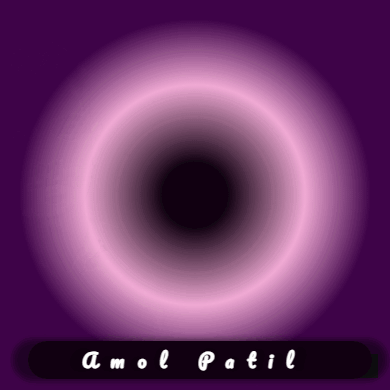

<!DOCTYPE html>
<html lang="en">
<head>
    <meta charset="UTF-8">
    <meta name="viewport" content="width=device-width, initial-scale=1.0">
    <meta name="description" content="Amol Patil - Software Developer specializing in Mobile App Development (Flutter, Android, iOS) and MERN Stack.">
    <meta name="keywords" content="Amol Patil, Software Developer, Mobile App Developer, Flutter, Android, iOS, MERN Stack">
    <meta name="author" content="Amol Patil">
    <title>Amol Patil - Software Developer</title>
    <link rel="stylesheet" href="https://cdnjs.cloudflare.com/ajax/libs/font-awesome/6.4.2/css/all.min.css">
    
</head>
<body>

    

        
        <h1>Hi, I'm Amol Patil! 👋</h1>
        
Software Developer | Mobile App Specialist | MERN Stack Enthusiast

        
Passionate about creating innovative mobile and web applications. Always exploring new technologies to build efficient and scalable solutions.

        <h2>📢 Connect with me</h2>
        <ul class="social-links">
            <li><a href="https://github.com/AmolPatil-Git" target="_blank"><i class="fa-brands fa-github"></i> GitHub</a></li>
            <li><a href="https://www.linkedin.com/in/amol-patil-372641165/" target="_blank"><i class="fa-brands fa-linkedin"></i> LinkedIn</a></li>
            <li><a href="https://x.com/amol1781994" target="_blank"><i class="fa-brands fa-twitter"></i> Twitter (X)</a></li>
            <li><a href="https://www.instagram.com/amol1781994/" target="_blank"><i class="fa-brands fa-instagram"></i> Instagram</a></li>
            <li><a href="https://www.facebook.com/profile.php?id=100008380546793" target="_blank"><i class="fa-brands fa-facebook"></i> Facebook</a></li>
        </ul>
    

</body>
</html>

<!---  
# Hi there, I'm Amol! 👋  
  

## I'm a Software Developer specializing in Mobile App Development 🚀  
  

### About Me  
- 👋 Hi, I’m **Amol Patil** (@AmolPatil-Git)  
- 👀 Passionate about **Mobile Application Development** 📱  
- 🎯 Skilled in **Flutter, Android, iOS, and MERN Stack**  
- 🔥 Always eager to explore **new technologies** and build **innovative software solutions**  
- 😄 Pronouns: **Software Developer**  
- 💡 Motto: _"Never stop creating new ideas!"_  

---

### 🚀 Tech Stack & Tools  
- **Mobile:** Flutter, Android (Java/Kotlin), iOS (Swift)  
- **Web:** MERN Stack (MongoDB, Express.js, React, Node.js)  
- **Version Control:** Git & GitHub  
- **Tools & IDEs:** VS Code, Android Studio, Xcode  

---

### 📫 Let's Connect  
  
  
  

---  

⭐ **Feel free to check out my repositories and contribute!**  

--->  

<!---  
### Hi there, I'm Amol! 👋
 

### I'm a software developer and i development mobile applications.   

- 👋 Hi, I’m @AmolPatil-Git
- 👀 I’m interested in mobile Application Languages 📱
- 😄 Pronouns: Software Developer
- 💪🏼 Future Goals: Exploring new technologies and developing software solutions. - Never stop creating new ideas.

--->

